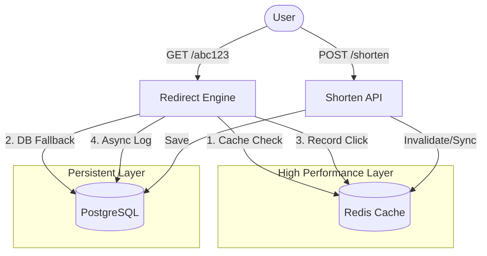

# 🚀 Shorter.io: Modern URL Shortener


**Shorter.io** is a production-grade, high-performance URL shortening service designed for scale and developer experience. Built with a modern Python stack, it features sub-millisecond redirections via Redis and real-time analytics.

---

## ✨ Features

- **⚡ Blazing Fast Redirection**: Redis-first caching strategy ensures minimal latency.
- **📊 Real-time Analytics**: Atomic click counters and detailed event logging.
- **🛡️ Production Grade**: Built-in rate limiting, security headers, and JWT-ready auth.
- **🎨 Sleek Dashboard**: One-page glassmorphism UI built with **Tailwind CSS** and **HTMX**.
- **🐳 DevOps Ready**: Fully containerized with Docker and Docker Compose.
- **🛠️ Developer First**: Interactive API docs via Swagger (OpenAPI 3.1).

---

## 🏗️ Architecture

Shorter.io uses a hybrid storage approach to balance performance and persistence.



### How it works:
1.  **Redirection**: When a short URL is accessed, the service first checks **Redis**. If it's a hit, 307 redirect is served immediately. If a miss, it falls back to **PostgreSQL**, caches the result, and then redirects.
2.  **Analytics**: Click counts are incremented atomically in Redis (`INCR`). Detailed metadata (IP, User-Agent, Referrer) is queued as an **asynchronous background task** to ensure the user's redirect isn't delayed by database I/O.
3.  **Local Fallback**: For easy local development without infrastructure, the service automatically falls back to **SQLite** and an **In-Memory Cache** if Postgres/Redis are unavailable.

---

## 🚀 Quick Start

### 1. Using Docker (Recommended)
```bash
docker-compose up --build
```
Access the dashboard at `http://localhost:8000`.

### 2. Local Manual Setup
```bash
# Clone the repository
git clone https://github.com/yourusername/url-shortener.git
cd url-shortener

# Create virtual environment
python -m venv venv
source venv/bin/activate

# Install dependencies
pip install -r requirements.txt

# Run the app
uvicorn app.main:app --reload
```

---

## 🛠️ Tech Stack

| Component | Technology | Role |
| :--- | :--- | :--- |
| **Backend** | FastAPI | Async Web Framework |
| **ORM** | SQLAlchemy 2.0 | Async Database Interaction |
| **Cache** | Redis | Fast Lookups & Atomic Counters |
| **Database** | PostgreSQL | Persistent Storage |
| **Frontend** | Tailwind CSS | Utility-first Styling |
| **UX** | HTMX | Seamless Interactive UX |
| **Schema** | Pydantic v2 | Data Validation |

---

## 📈 System Design & Scaling

This service is designed with scalability in mind:
- **Write-Heavy Resilience**: Using background tasks for analytics allows Postgres to handle spikes without blocking user traffic.
- **Distributed Ready**: Redis can be swapped for a Redis Cluster, and PostgreSQL can be horizontally scaled with Read Replicas.
- **Stateless API**: The FastAPI application is fully stateless, allowing it to be scaled horizontally behind a Load Balancer (Nginx/HAProxy).

### Potential Improvements:
- [ ] **GeoIP Integration**: Map IP addresses to countries for richer analytics.
- [ ] **Custom Domains**: Allow users to bring their own branded domains.
- [ ] **QR Code Generation**: Automatically generate QR codes for every shortened link.
- [ ] **Advanced Charts**: Interactive time-series data visualization using Chart.js.

---

## 🛡️ Security
- **Rate Limiting**: Integrated `slowapi` to prevent brute-force attacks on shortening.
- **Validation**: Strict URL validation via Pydantic and `validators` lib.
- **Privacy**: IP addresses are stored securely (consider hashing in highly sensitive environments).

---

## 📄 License
Distributed under the MIT License. See `LICENSE` for more information.

---

Built with ❤️ by [Your Name]
